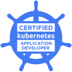

### Hi there 👋
✨ I am a seasoned software engineer with over 16 years of work experience. I primarily work with the Java/Spring/Kotlin
stack. I also possess experience in developing cloud-native applications leveraging Docker, Kubernetes, and AWS. 
Additionally, I have expertise in front-end development using JS/TS/React. Moreover, I hold a strong interest in 
software security concepts and have worked extensively with OAuth2 and PKI for several years.

✨ For the past 11 years, I have served as a Senior Software Engineer across 4 companies. I have experience working with
various software architectures, including microservices, monolithic, and modular-monolithic. I actively mentor and 
participate in pair-programming with other engineers as part of Scrum and SAFe teams.

✨ I enjoy working with enterprise applications, open-source projects, and exploring new technologies. I have ventured 
into new languages and tools like Python and Flutter to push myself beyond my comfort zone.🚀

---

### 💻 My Skills

  
  
  
  
  
  
  
  
  
  
  
  
  
  

---

### 🚩 My Certifications
<table style="border: 0">
    <tr>
        <td></td>
        <td>
            <strong>
                <a href="https://catalog-education.oracle.com/pls/certview/sharebadge?id=B079B426FC3364951989AADDF6760278BB54B228BD3EDAFE663337FF6251E62C">
                    Oracle Certified Professional | Java SE 17 Developer
                </a>
            </strong>
        </td>
    </tr>
    <tr>
        <td></td>
        <td>
            <strong>
                <a href="https://www.credly.com/badges/03d264d6-1960-4552-a239-43934acca0f8/public_url">
                    Spring Certified Professional 2024
                </a>
            </strong>
        </td>
    </tr>
    <tr>
        <td></td>
        <td>
            <strong>
                <a href="https://www.credly.com/badges/b6cd71d7-cf3f-4da6-9f95-6018ec20460b/public_url">
                    AWS Certified Developer – Associate
                </a>
            </strong>
        </td>
    </tr>
    <tr>
        <td></td>
        <td>
            <strong>
                <a href="https://www.credly.com/badges/fb006746-0c20-47cd-9a01-c5d97f19991d/public_url">
                    CKAD: Certified Kubernetes Application Developer
                </a>
            </strong>
        </td>
    </tr>
</table>

---

### 📫 Contact Me
<a href="https://www.linkedin.com/in/ali-jalal/">
    

        <svg xmlns="http://www.w3.org/2000/svg" width="16" height="16" viewBox="0 0 16 16" fill="none" role="img" aria-labelledby="akrevz51hr5umtwirdmufs92nhjqyicd" class="octicon"><title id="akrevz51hr5umtwirdmufs92nhjqyicd">LinkedIn</title>
            <g clip-path="url(#clip0_202_91845)">
                <path d="M14.5455 0H1.45455C0.650909 0 0 0.650909 0 1.45455V14.5455C0 15.3491 0.650909 16 1.45455 16H14.5455C15.3491 16 16 15.3491 16 14.5455V1.45455C16 0.650909 15.3491 0 14.5455 0ZM5.05746 13.0909H2.912V6.18764H5.05746V13.0909ZM3.96291 5.20073C3.27127 5.20073 2.712 4.64 2.712 3.94982C2.712 3.25964 3.272 2.69964 3.96291 2.69964C4.65236 2.69964 5.21309 3.26036 5.21309 3.94982C5.21309 4.64 4.65236 5.20073 3.96291 5.20073ZM13.0938 13.0909H10.9498V9.73382C10.9498 8.93309 10.9353 7.90327 9.83491 7.90327C8.71855 7.90327 8.54691 8.77527 8.54691 9.67564V13.0909H6.40291V6.18764H8.46109V7.13091H8.49018C8.77673 6.58836 9.47636 6.016 10.52 6.016C12.6924 6.016 13.0938 7.44582 13.0938 9.30473V13.0909V13.0909Z" fill="currentColor"></path>
            </g>
        </svg>
        <b>Message me on LinkedIn</b>
    

</a>
